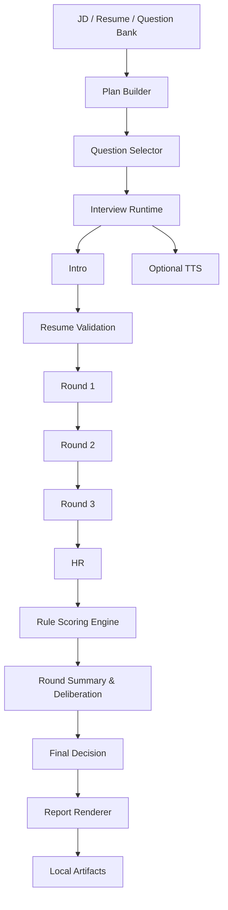

<!-- markdownlint-disable MD013 -->
# Android Interview

English | [中文](./README.zh-CN.md)

`android-interview` is a Python-based skill for running structured Android mock interviews from a JD, a resume, and optional Markdown question banks. It supports both batch simulation and turn-by-turn interactive sessions, then writes local interview artifacts such as reports, transcripts, scorecards, and optional TTS audio files.

## Highlights

- Runs a multi-round Android interview flow instead of flat one-off Q&A
- Uses JD, resume, and question-bank evidence to build a traceable interview plan
- Supports batch MVP runs and interactive CLI interviews
- Validates external Markdown question banks before the session starts
- Writes local artifacts including `report.html`, `score.json`, `transcript.md`, `screening-summary.md`, and checkpoint files
- Optionally generates TTS audio artifacts when `edge-tts` is installed

## Architecture

This skill is a thin manifest plus a Python runtime.



- The runtime executes the full interview sequence, not a single flat Q&A.
- In documentation, the runtime `screening` round is described as `Resume Validation` to distinguish it from the pre-interview screening summary artifact.
- Each round can contain multiple main questions plus follow-ups.
- The runtime can switch topic, increase difficulty, lower difficulty, or hold a round for one more probe.

- `SKILL.md` defines when to use the skill and which scripts are available.
- `scripts/interview_core.py` holds the planning, scoring, reporting, and routing logic.
- `scripts/run_interactive_session.py` and `scripts/run_interview_session.py` are the main runtimes.
- `tests/skills/android-interview/` provides fixtures for repeatable validation.
- `tests/scenarios/android-interview/` and `tooling/run-skill-validation.py` verify the end-to-end behavior.

## Flow

1. Parse JD, resume, and question bank inputs.
2. Build a round plan with focus areas, language, target question counts, and round ordering.
3. Generate pre-interview screening and resume-prep artifacts.
4. Select bank questions and generate fallback questions when coverage is incomplete.
5. Run `intro`, `screening` (resume validation), `round1`, `round2`, `round3`, and `hr` with follow-ups, adaptive routing, and optional pause/resume.
6. Score each answer with a rule-based evaluator and aggregate round summaries and deliberations.
7. Render transcripts, scorecards, panel notes, pass/fail summaries, and the final HTML report.

## Directory Layout

```text
skills/android-interview/
├── agents/
│   └── openai.yaml
├── scripts/
│   ├── interview_core.py
│   ├── question_bank.py
│   ├── run_interactive_session.py
│   ├── run_interview_session.py
│   ├── run_mvp_demo.py
│   ├── run_resume_demo.py
│   ├── tts_support.py
│   ├── validate_question_bank.py
│   └── requirements.txt
├── README.md
├── README.zh-CN.md
└── SKILL.md
```

## Requirements

- `python3`
- `pip`
- Python packages listed in `skills/android-interview/scripts/requirements.txt`

Install dependencies from the repository root:

```bash
python3 -m pip install -r skills/android-interview/scripts/requirements.txt
```

If you want audio output, keep `edge-tts` installed and add `--enable-tts` to the session command.

## Quick Start

All commands below assume you are running from the repository root.

### 1. Run the batch MVP demo

```bash
python3 skills/android-interview/scripts/run_mvp_demo.py \
  --session-id local-demo \
  --output-dir dist/interview-reports/local-demo \
  --enable-tts
```

This wrapper uses the repository fixtures under `tests/skills/android-interview/fixtures/` and calls `run_interview_session.py`.

### 2. Run a scripted interactive session

```bash
python3 skills/android-interview/scripts/run_interactive_session.py \
  --jd tests/skills/android-interview/fixtures/jd.md \
  --resume tests/skills/android-interview/fixtures/resume.md \
  --question-bank tests/skills/android-interview/fixtures/question-bank \
  --scripted-answers tests/skills/android-interview/fixtures/answers.json \
  --output-dir dist/interview-reports/local-interactive-demo \
  --session-id local-interactive-demo
```

### 3. Run a real interactive practice session

```bash
python3 skills/android-interview/scripts/run_interactive_session.py \
  --jd /path/to/jd.md \
  --resume /path/to/resume.md \
  --question-bank /path/to/question-bank \
  --output-dir dist/interview-reports/my-session \
  --session-id my-session
```

In live CLI mode, the session supports `/help`, `/status`, `/plan`, `/feedback`, `/scorecard`, `/checkpoint`, `/repeat`, `/skip`, and `/quit`.

## Main Entry Points

- `scripts/run_interview_session.py`
  Batch interview pipeline with scripted answers.
- `scripts/run_interactive_session.py`
  Turn-by-turn interview flow with multiple questions per round, follow-ups, checkpoints, and early termination controls.
- `scripts/run_mvp_demo.py`
  Repository fixture demo for the batch pipeline.
- `scripts/run_resume_demo.py`
  Pause-and-resume demo for checkpoint recovery.
- `scripts/validate_question_bank.py`
  Standalone validator for external Markdown question banks.

## Question Bank Validation

Validate a bank before using it in a real session:

```bash
python3 skills/android-interview/scripts/validate_question_bank.py \
  --question-bank tests/skills/android-interview/fixtures/question-bank \
  --output-dir dist/interview-reports/question-bank-validation
```

The validator reports:

- `question_bank_status`
- `question_count`
- `file_count`
- `error_count`
- `warning_count`

It returns exit code `2` when the bank is invalid, and exit code `3` when `--fail-on-warnings` is set and warnings exist.

## Question Bank Format

Each question file is a Markdown document with YAML frontmatter and structured sections. Example:

```md
---
id: round1-core-001
title: Lifecycle and State Handling
direction: android-core
round: round1
level: senior
difficulty: L3
language: en
tags:
  - lifecycle
  - viewmodel
source: custom-bank
competencies:
  - technical_depth
must_ask: true
follow_up_limit: 2
expected_signal: Candidate can reason about lifecycle transitions and durable state management.
---

## Question

How do you prevent lifecycle-related bugs when a feature has background work and frequently recreated screens?

## Intent

Evaluate lifecycle reasoning, state separation, and practical Android implementation discipline.

## Follow-ups

- Which part belongs in UI state and which part belongs in persistent state?
- How did you verify the fix was stable?

## Scoring Notes

- 1: only textbook lifecycle terms
- 3: workable ViewModel and lifecycle-aware answer
- 5: clear state model, failure mode, and verification path

## Red Flags

- Cannot explain recreation or duplicate work issues

## Good Signals

- Can explain state boundaries
```

Supported values from the current validator:

- `round`: `intro`, `screening`, `round1`, `round2`, `round3`, `hr`
- `level`: `mid`, `senior`, `tl`
- `language`: `zh`, `en`, `bilingual`
- `difficulty`: `L1`, `L2`, `L3`, `L4`, `L5`

## Useful Session Options

- `--mode simulate|screening|round1|round2|round3|hr`
- `--level mid|senior|tl`
- `--language zh|en|bilingual`
- `--enable-tts`
- `--voice en-US-AndrewNeural`
- `--default-persona technical-deep-diver`
- `--round-persona-overrides round2=business-outcome,hr=leadership-evaluator`
- `--round-language-overrides round2=bilingual,hr=zh`
- `--question-target-overrides round1=1,round2=2,round3=1,hr=1`
- `--no-live-feedback`
- `--adaptive-runtime-routing`
- `--deliberation-bridge-probes`
- `--stop-after-questions N`
- `--resume-state /path/to/session-checkpoint.json`

## Output Artifacts

Session output directories can include:

- `session.json`
- `screening-summary.json`
- `screening-summary.md`
- `session-checkpoint.json`
- `session-progress.json`
- `score.json`
- `interview-plan.json`
- `panel-notes.json`
- `panel-notes.md`
- `question-bank-validation.json`
- `question-bank-validation.md`
- `resume-prep.json`
- `resume-prep.md`
- `turn-events.json`
- `transcript.md`
- `report.html`
- `mail-reject.html`
- `fail-summary.md`
- `pass-summary.md`
- `tts/`

The exact set depends on whether the run is interactive, whether the candidate passes, and whether TTS is enabled.

## Validation

The repository test plan uses these commands:

```bash
python3 -m pip install pyyaml jinja2 edge-tts
python3 skills/android-interview/scripts/run_mvp_demo.py --session-id local-demo --output-dir dist/interview-reports/local-demo --enable-tts
python3 skills/android-interview/scripts/run_interactive_session.py --jd tests/skills/android-interview/fixtures/jd.md --resume tests/skills/android-interview/fixtures/resume.md --question-bank tests/skills/android-interview/fixtures/question-bank --scripted-answers tests/skills/android-interview/fixtures/answers.json --output-dir dist/interview-reports/local-interactive-demo --session-id local-interactive-demo
python3 tooling/run-skill-validation.py --skill android-interview
```

See `tests/skills/android-interview/MVP_TEST_PLAN.md` for the current acceptance baseline.

## License

This skill lives inside the `hulk-skills` repository, which is licensed under `MIT`.
