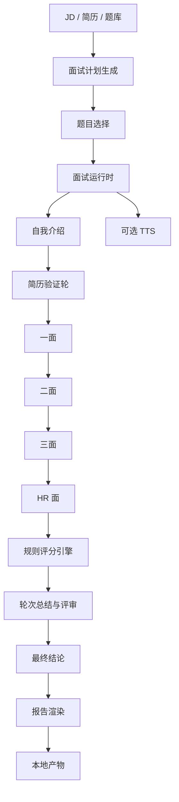

<!-- markdownlint-disable MD013 -->
# Android Interview

[English](./README.md) | 中文

`android-interview` 是一个基于 Python 的 Android 模拟面试 skill。它可以从 JD、简历以及可选的 Markdown 题库中构建结构化面试流程，支持批处理模拟和逐轮交互式练习，并输出本地报告、评分、转录稿、检查点和可选的 TTS 语音产物。

## 亮点

- 不是单轮问答，而是多轮次、多问题的结构化 Android 面试流程
- 基于 JD、简历和题库内容生成可追溯的面试计划
- 同时支持批量 MVP 跑通和交互式 CLI 面试
- 在正式面试前先校验外部 Markdown 题库
- 输出 `report.html`、`score.json`、`transcript.md`、`screening-summary.md` 等本地产物
- 安装 `edge-tts` 后可以额外生成 TTS 音频文件

## 技术架构

这个 skill 目前本质上是“manifest + Python 运行时”的组合。



- 运行时执行的是完整面试流程，而不是单题问答。
- 文档中把运行时的 `screening` 轮称为“简历验证轮”，用于和面试前生成的“预筛选结果”区分。
- 每一轮都可以包含多道主问题和若干追问。
- 运行时可以切题、升高难度、降低难度，或 hold 一轮再做补充探针。

- `SKILL.md` 只负责描述 skill 的用途和可调用脚本。
- `scripts/interview_core.py` 承担计划、选题、评分、总结和报告生成。
- `scripts/run_interactive_session.py` 与 `scripts/run_interview_session.py` 是主要运行入口。
- `tests/skills/android-interview/` 提供可重复验证的 fixtures。
- `tests/scenarios/android-interview/` 和 `tooling/run-skill-validation.py` 负责端到端校验。

## 流程说明

1. 解析 JD、简历和题库输入。
2. 根据轮次生成计划，确定重点、语言模式、题目数量和轮次顺序。
3. 先生成预筛选结果和简历准备简报。
4. 先选题库题，不够时再生成兜底题。
5. 按 `intro`、`screening`（简历验证轮）、`round1`、`round2`、`round3`、`hr` 执行完整面试，包含追问、自适应路由和可选暂停恢复。
6. 用规则引擎对每个回答打分，并聚合成轮次总结与评审结论。
7. 渲染转录稿、评分卡、panel notes、通过/失败总结和最终 HTML 报告。

## 目录结构

```text
skills/android-interview/
├── agents/
│   └── openai.yaml
├── scripts/
│   ├── interview_core.py
│   ├── question_bank.py
│   ├── run_interactive_session.py
│   ├── run_interview_session.py
│   ├── run_mvp_demo.py
│   ├── run_resume_demo.py
│   ├── tts_support.py
│   ├── validate_question_bank.py
│   └── requirements.txt
├── README.md
├── README.zh-CN.md
└── SKILL.md
```

## 环境要求

- `python3`
- `pip`
- `skills/android-interview/scripts/requirements.txt` 中列出的 Python 依赖

在仓库根目录执行安装：

```bash
python3 -m pip install -r skills/android-interview/scripts/requirements.txt
```

如果你需要音频产物，请保留 `edge-tts` 依赖，并在运行命令里加上 `--enable-tts`。

## 快速开始

下面所有命令都默认在仓库根目录执行。

### 1. 跑通批处理 MVP 示例

```bash
python3 skills/android-interview/scripts/run_mvp_demo.py \
  --session-id local-demo \
  --output-dir dist/interview-reports/local-demo \
  --enable-tts
```

这个脚本会直接使用 `tests/skills/android-interview/fixtures/` 下的仓库内置样例，并调用 `run_interview_session.py`。

### 2. 运行带脚本答案的交互式会话

```bash
python3 skills/android-interview/scripts/run_interactive_session.py \
  --jd tests/skills/android-interview/fixtures/jd.md \
  --resume tests/skills/android-interview/fixtures/resume.md \
  --question-bank tests/skills/android-interview/fixtures/question-bank \
  --scripted-answers tests/skills/android-interview/fixtures/answers.json \
  --output-dir dist/interview-reports/local-interactive-demo \
  --session-id local-interactive-demo
```

### 3. 运行真实的交互式练习

```bash
python3 skills/android-interview/scripts/run_interactive_session.py \
  --jd /path/to/jd.md \
  --resume /path/to/resume.md \
  --question-bank /path/to/question-bank \
  --output-dir dist/interview-reports/my-session \
  --session-id my-session
```

在真实 CLI 会话里，可用命令包括 `/help`、`/status`、`/plan`、`/feedback`、`/scorecard`、`/checkpoint`、`/repeat`、`/skip` 和 `/quit`。

## 主要入口脚本

- `scripts/run_interview_session.py`
  使用脚本化答案执行批处理面试流程。
- `scripts/run_interactive_session.py`
  逐轮执行的交互式面试，支持单轮多题、追问、检查点、提前终止和恢复。
- `scripts/run_mvp_demo.py`
  基于仓库内置 fixtures 的批处理示例入口。
- `scripts/run_resume_demo.py`
  用于验证 checkpoint 恢复能力的暂停/恢复示例。
- `scripts/validate_question_bank.py`
  独立的外部 Markdown 题库校验工具。

## 题库校验

在正式使用题库前，建议先做一次校验：

```bash
python3 skills/android-interview/scripts/validate_question_bank.py \
  --question-bank tests/skills/android-interview/fixtures/question-bank \
  --output-dir dist/interview-reports/question-bank-validation
```

校验输出会包含：

- `question_bank_status`
- `question_count`
- `file_count`
- `error_count`
- `warning_count`

当题库无效时返回码为 `2`；如果启用了 `--fail-on-warnings` 且存在 warning，则返回码为 `3`。

## 题库格式

每道题是一个带 YAML frontmatter 的 Markdown 文件，正文按固定 section 组织。示例：

```md
---
id: round1-core-001
title: Lifecycle and State Handling
direction: android-core
round: round1
level: senior
difficulty: L3
language: en
tags:
  - lifecycle
  - viewmodel
source: custom-bank
competencies:
  - technical_depth
must_ask: true
follow_up_limit: 2
expected_signal: Candidate can reason about lifecycle transitions and durable state management.
---

## Question

How do you prevent lifecycle-related bugs when a feature has background work and frequently recreated screens?

## Intent

Evaluate lifecycle reasoning, state separation, and practical Android implementation discipline.

## Follow-ups

- Which part belongs in UI state and which part belongs in persistent state?
- How did you verify the fix was stable?

## Scoring Notes

- 1: only textbook lifecycle terms
- 3: workable ViewModel and lifecycle-aware answer
- 5: clear state model, failure mode, and verification path

## Red Flags

- Cannot explain recreation or duplicate work issues

## Good Signals

- Can explain state boundaries
```

当前校验器支持的关键枚举值：

- `round`: `intro`、`screening`、`round1`、`round2`、`round3`、`hr`
- `level`: `mid`、`senior`、`tl`
- `language`: `zh`、`en`、`bilingual`
- `difficulty`: `L1`、`L2`、`L3`、`L4`、`L5`

## 常用会话参数

- `--mode simulate|screening|round1|round2|round3|hr`
- `--level mid|senior|tl`
- `--language zh|en|bilingual`
- `--enable-tts`
- `--voice en-US-AndrewNeural`
- `--default-persona technical-deep-diver`
- `--round-persona-overrides round2=business-outcome,hr=leadership-evaluator`
- `--round-language-overrides round2=bilingual,hr=zh`
- `--question-target-overrides round1=1,round2=2,round3=1,hr=1`
- `--no-live-feedback`
- `--adaptive-runtime-routing`
- `--deliberation-bridge-probes`
- `--stop-after-questions N`
- `--resume-state /path/to/session-checkpoint.json`

## 输出产物

会话输出目录中可能包含：

- `session.json`
- `screening-summary.json`
- `screening-summary.md`
- `session-checkpoint.json`
- `session-progress.json`
- `score.json`
- `interview-plan.json`
- `panel-notes.json`
- `panel-notes.md`
- `question-bank-validation.json`
- `question-bank-validation.md`
- `resume-prep.json`
- `resume-prep.md`
- `turn-events.json`
- `transcript.md`
- `report.html`
- `mail-reject.html`
- `fail-summary.md`
- `pass-summary.md`
- `tts/`

具体产物会根据是否为交互模式、候选人是否通过、以及是否启用 TTS 而有所不同。

## 校验命令

仓库当前测试计划中使用的核心命令如下：

```bash
python3 -m pip install pyyaml jinja2 edge-tts
python3 skills/android-interview/scripts/run_mvp_demo.py --session-id local-demo --output-dir dist/interview-reports/local-demo --enable-tts
python3 skills/android-interview/scripts/run_interactive_session.py --jd tests/skills/android-interview/fixtures/jd.md --resume tests/skills/android-interview/fixtures/resume.md --question-bank tests/skills/android-interview/fixtures/question-bank --scripted-answers tests/skills/android-interview/fixtures/answers.json --output-dir dist/interview-reports/local-interactive-demo --session-id local-interactive-demo
python3 tooling/run-skill-validation.py --skill android-interview
```

当前验收基线可参考 `tests/skills/android-interview/MVP_TEST_PLAN.md`。

## License

这个 skill 位于 `hulk-skills` 仓库中，仓库整体使用 `MIT` 协议。
