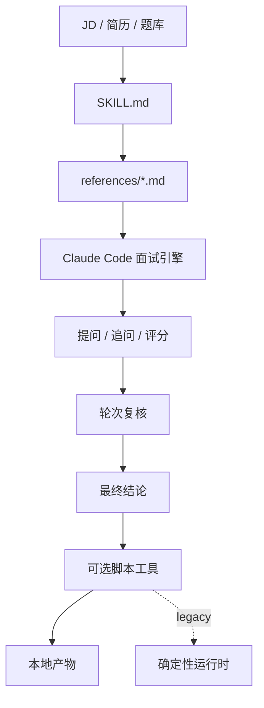

<!-- markdownlint-disable MD013 -->
# Android Interview

[English](./README.md) | 中文

`android-interview` 是一个以 Markdown 为主、以 Claude Code 为主执行者的 Android 模拟面试 skill。主要面试流程应由 `SKILL.md` 和 `references/*.md` 直接驱动；本地 Python 脚本只作为题库校验、报告渲染、TTS 和确定性回归的辅助工具。

## 亮点

- 不是单轮问答，而是多轮次、多问题的结构化 Android 面试流程
- 面试主逻辑沉淀在 `SKILL.md` 和 `references/*.md`
- 基于 JD、简历和题库内容生成可追溯的面试计划
- 保留批量 MVP 与交互式 CLI 运行器作为 fallback、demo 和回归能力
- 在正式面试前先校验外部 Markdown 题库
- 输出 `report.html`、`score.json`、`transcript.md`、`screening-summary.md` 等本地产物
- 安装 `edge-tts` 后可以额外生成 TTS 音频文件

## 技术架构

这个 skill 现在的目标结构是“Markdown-first Skill + 可选本地辅助脚本”。



- `SKILL.md` 负责定义 skill 的入口和 references 的读取顺序。
- `references/*.md` 承担主要面试智能，包括 intake、规划、提问、追问、评分、一致性检查和报告输出。
- `scripts/interview_core.py` 承担确定性兜底的计划、选题、评分、总结和报告生成。
- `scripts/render_skill_artifacts.py` 可以从对话里形成的结构化 `session.json` 和 `score.json` 直接渲染本地产物，而不要求 legacy runtime 先执行完整面试。
- `scripts/run_interactive_session.py` 与 `scripts/run_interview_session.py` 现在应视为 legacy scripted runtime，用于 demo、回归和显式 fallback。
- `scripts/ai_client.py`、`scripts/ai_schemas.py`、`scripts/ai_services.py` 为 legacy 脚本运行时提供可热插拔 AI 边界。
- `tests/skills/android-interview/` 提供可重复验证的 fixtures。
- `tests/scenarios/android-interview/` 和 `tooling/run-skill-validation.py` 负责端到端校验。

## 流程说明

1. 读取 `SKILL.md` 和必需的 `references/*.md`。
2. 将 JD 和简历分析为结构化画像。
3. 在会话中直接规划轮次、人设、题目策略和输出模式。
4. 在对话里逐题面试，并根据证据缺口追问。
5. 仅在需要题库校验、报告渲染、TTS 或脚本化回归时调用本地脚本。
6. 需要本地产物时，再渲染 transcript、scorecard、panel notes、summary 或 HTML 报告。

## 推荐使用方式

默认把 Skill 会话本身当成产品主入口。

1. 在 Claude Code 或 Codex 中提供 JD、简历和目标级别。
2. 让助手读取 `SKILL.md` 和 `references/*.md`，直接在会话里完成面试。
3. 如果需要本地产物，让助手先产出结构化 `session.json` 和 `score.json`，再调用 `scripts/render_skill_artifacts.py` 渲染。
4. 只有在你明确需要 deterministic fallback、demo 或回归验证时，才使用脚本运行器。

## AI 运行模式

现有确定性实现已降级为完整兜底方案，可以通过一个参数热插拔：

- `--ai-mode off`
  - 一键隔离 AI，端到端只运行确定性兜底方案。
- `--ai-mode assist`
  - 优先使用 AI 评分 / 追问；provider 不可用或返回非法 JSON 时自动降级。
- `--ai-mode required`
  - 强制使用 AI；AI 不可用时直接失败，不静默降级。

Provider 相关参数：

- `--ai-provider auto|openai-compatible|fixture|none`
- `--model <name>`
- `--ai-fixture-dir /path/to/fixtures`

`openai-compatible` 从环境变量读取 `OPENAI_API_KEY`，也支持可选的 `OPENAI_BASE_URL` 和 `OPENAI_MODEL`。每次运行会写出 `ai-runtime.json`；AI 请求和失败审计记录会写入 `ai-calls/`。

## 目录结构

```text
skills/android-interview/
├── agents/
│   └── openai.yaml
├── references/
│   ├── 00-overview.md
│   ├── 01-intake.md
│   ├── 02-jd-resume-analysis.md
│   ├── 03-interview-flow.md
│   ├── 04-question-generation.md
│   ├── 05-follow-up-policy.md
│   ├── 06-scoring-rubric.md
│   ├── 07-consistency-check.md
│   ├── 08-round-deliberation.md
│   ├── 09-report-output.md
│   └── 10-question-bank-format.md
├── scripts/
│   ├── interview_core.py
│   ├── question_bank.py
│   ├── render_skill_artifacts.py
│   ├── run_interactive_session.py
│   ├── run_interview_session.py
│   ├── run_mvp_demo.py
│   ├── run_resume_demo.py
│   ├── tts_support.py
│   ├── validate_question_bank.py
│   └── requirements.txt
├── README.md
├── README.zh-CN.md
└── SKILL.md
```

## 环境要求

- `python3`
- `pip`
- `skills/android-interview/scripts/requirements.txt` 中列出的 Python 依赖

在仓库根目录执行安装：

```bash
python3 -m pip install -r skills/android-interview/scripts/requirements.txt
```

如果你需要音频产物，请保留 `edge-tts` 依赖，并在运行命令里加上 `--enable-tts`。

## Skill 优先快速开始

优先直接在会话里使用这个 skill。一个典型请求可以是：

```text
请使用 android-interview skill。这是 JD，这是简历，目标级别是 senior，我需要完整面试和本地报告产物。
```

如果会话里已经形成了结构化的 `session.json` 和 `score.json`，可以用下面的命令渲染标准本地产物：

```bash
python3 skills/android-interview/scripts/render_skill_artifacts.py \
  --session-json /path/to/session.json \
  --score-json /path/to/score.json \
  --output-dir dist/interview-reports/rendered-from-skill
```

## Legacy 运行器快速开始

下面所有命令都默认在仓库根目录执行。这些命令主要用于 fallback、demo 或回归验证，而不是默认的 skill 使用形态。

### 1. 跑通批处理 MVP 示例

```bash
python3 skills/android-interview/scripts/run_mvp_demo.py \
  --session-id local-demo \
  --output-dir dist/interview-reports/local-demo \
  --enable-tts
```

这个脚本会直接使用 `tests/skills/android-interview/fixtures/` 下的仓库内置样例，并调用 `run_interview_session.py`。

### 2. 运行带脚本答案的交互式会话

```bash
python3 skills/android-interview/scripts/run_interactive_session.py \
  --jd tests/skills/android-interview/fixtures/jd.md \
  --resume tests/skills/android-interview/fixtures/resume.md \
  --question-bank tests/skills/android-interview/fixtures/question-bank \
  --scripted-answers tests/skills/android-interview/fixtures/answers.json \
  --output-dir dist/interview-reports/local-interactive-demo \
  --session-id local-interactive-demo
```

### 3. 运行真实的交互式练习

```bash
python3 skills/android-interview/scripts/run_interactive_session.py \
  --jd /path/to/jd.md \
  --resume /path/to/resume.md \
  --question-bank /path/to/question-bank \
  --output-dir dist/interview-reports/my-session \
  --session-id my-session
```

在真实 CLI 会话里，可用命令包括 `/help`、`/status`、`/plan`、`/feedback`、`/scorecard`、`/checkpoint`、`/repeat`、`/skip` 和 `/quit`。

## 主要入口脚本

- `scripts/run_interview_session.py`
  使用脚本化答案执行批处理面试流程。
- `scripts/run_interactive_session.py`
  逐轮执行的交互式面试，支持单轮多题、追问、检查点、提前终止和恢复。
- `scripts/run_mvp_demo.py`
  基于仓库内置 fixtures 的批处理示例入口。
- `scripts/run_resume_demo.py`
  用于验证 checkpoint 恢复能力的暂停/恢复示例。
- `scripts/validate_question_bank.py`
  独立的外部 Markdown 题库校验工具。

## 题库校验

在正式使用题库前，建议先做一次校验：

```bash
python3 skills/android-interview/scripts/validate_question_bank.py \
  --question-bank tests/skills/android-interview/fixtures/question-bank \
  --output-dir dist/interview-reports/question-bank-validation
```

校验输出会包含：

- `question_bank_status`
- `question_count`
- `file_count`
- `error_count`
- `warning_count`

当题库无效时返回码为 `2`；如果启用了 `--fail-on-warnings` 且存在 warning，则返回码为 `3`。

## 题库格式

每道题是一个带 YAML frontmatter 的 Markdown 文件，正文按固定 section 组织。示例：

```md
---
id: round1-core-001
title: Lifecycle and State Handling
direction: android-core
round: round1
level: senior
difficulty: L3
language: en
tags:
  - lifecycle
  - viewmodel
source: custom-bank
competencies:
  - technical_depth
must_ask: true
follow_up_limit: 2
expected_signal: Candidate can reason about lifecycle transitions and durable state management.
---

## Question

How do you prevent lifecycle-related bugs when a feature has background work and frequently recreated screens?

## Intent

Evaluate lifecycle reasoning, state separation, and practical Android implementation discipline.

## Follow-ups

- Which part belongs in UI state and which part belongs in persistent state?
- How did you verify the fix was stable?

## Scoring Notes

- 1: only textbook lifecycle terms
- 3: workable ViewModel and lifecycle-aware answer
- 5: clear state model, failure mode, and verification path

## Red Flags

- Cannot explain recreation or duplicate work issues

## Good Signals

- Can explain state boundaries
```

当前校验器支持的关键枚举值：

- `round`: `intro`、`screening`、`round1`、`round2`、`round3`、`hr`
- `level`: `mid`、`senior`、`tl`
- `language`: `zh`、`en`、`bilingual`
- `difficulty`: `L1`、`L2`、`L3`、`L4`、`L5`

## 常用会话参数

- `--mode simulate|screening|round1|round2|round3|hr`
- `--level mid|senior|tl`
- `--language zh|en|bilingual`
- `--enable-tts`
- `--voice en-US-AndrewNeural`
- `--default-persona technical-deep-diver`
- `--round-persona-overrides round2=business-outcome,hr=leadership-evaluator`
- `--round-language-overrides round2=bilingual,hr=zh`
- `--question-target-overrides round1=1,round2=2,round3=1,hr=1`
- `--no-live-feedback`
- `--adaptive-runtime-routing`
- `--deliberation-bridge-probes`
- `--stop-after-questions N`
- `--resume-state /path/to/session-checkpoint.json`
- `--ai-mode off|assist|required`
- `--ai-provider auto|openai-compatible|fixture|none`
- `--model <name>`
- `--ai-fixture-dir /path/to/fixtures`

## 输出产物

会话输出目录中可能包含：

- `session.json`
- `screening-summary.json`
- `screening-summary.md`
- `session-checkpoint.json`
- `session-progress.json`
- `score.json`
- `ai-runtime.json`
- `ai-calls/`
- `interview-plan.json`
- `panel-notes.json`
- `panel-notes.md`
- `question-bank-validation.json`
- `question-bank-validation.md`
- `resume-prep.json`
- `resume-prep.md`
- `turn-events.json`
- `transcript.md`
- `report.html`
- `mail-reject.html`
- `fail-summary.md`
- `pass-summary.md`
- `tts/`

具体产物会根据是否为交互模式、候选人是否通过、以及是否启用 TTS 而有所不同。

## 校验命令

仓库当前测试计划中使用的核心命令如下：

```bash
python3 -m pip install pyyaml jinja2 edge-tts
python3 skills/android-interview/scripts/run_mvp_demo.py --session-id local-demo --output-dir dist/interview-reports/local-demo --enable-tts
python3 skills/android-interview/scripts/run_interactive_session.py --jd tests/skills/android-interview/fixtures/jd.md --resume tests/skills/android-interview/fixtures/resume.md --question-bank tests/skills/android-interview/fixtures/question-bank --scripted-answers tests/skills/android-interview/fixtures/answers.json --output-dir dist/interview-reports/local-interactive-demo --session-id local-interactive-demo
python3 tooling/run-skill-validation.py --skill android-interview
```

当前验收基线可参考 `tests/skills/android-interview/MVP_TEST_PLAN.md`。

## License

这个 skill 位于 `hulk-skills` 仓库中，仓库整体使用 `MIT` 协议。
